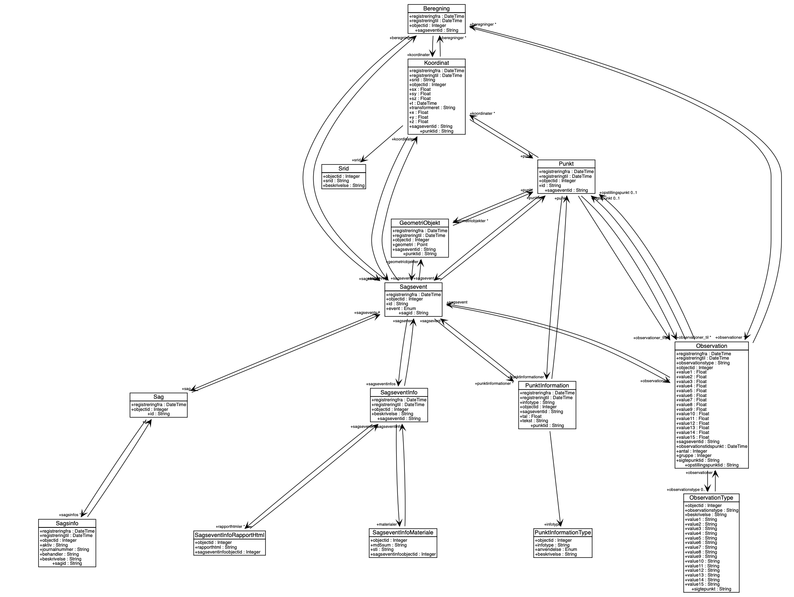

# fireapi

[](https://circleci.com/gh/Septima/fikspunktsregister) [](https://gitter.im/Septima/fikspunktsregister?utm_source=badge&utm_medium=badge&utm_campaign=pr-badge&utm_content=badge)

API til SDFEs kommende fikspunktsregister.

[UML diagram](./misc/fireapi-uml.png)


## API
Work in progress:
```python
from fireapi import FireDb
db = FireDb("fire:fire@localhost:1521/xe")
punkter = db.hent_alle_punkter()
```

For now there are no data in the database so `punkter` is an empty list.


## Local development
Install and activate development environment (called `fiskpunktsregister-dev`) and then run tests. Note that almost all 
tests require an active database.
```bash
conda env update -f environment-dev.yml
conda activate fikspunktsregister-dev
pytest
```

### Tests
Unit/integration tests are implemented with [pytest](https://pytest.org). Tests are run like described above.

Most tests require an active database. Connection parameters used by the tests are set by the following code
```python
user = os.environ.get("ORA_USER") or "fire"
password = os.environ.get("ORA_PASSWORD") or "fire"
host = os.environ.get("ORA_HOST") or "localhost"
port = os.environ.get("ORA_PORT") or "1521"
db = os.environ.get("ORA_db") or "xe"
```
 
 With an active conda environment tests can be run against a custom database on *nix by
```bash
export ORA_USER=custom_username
export ORA_PASSWORD=custom_password
export ORA_HOST=custom_host
export ORA_PORT=1522
export ORA_DB=custom_databasename
pytest
```
and on windows by
```bash
ORA_USER=custom_username
ORA_PASSWORD=custom_password
ORA_HOST=custom_host
ORA_PORT=1522
ORA_DB=custom_databasename
pytest
``` 
See section on [Docker](#Docker) for an easy way to create a local database.

### UML
A [UML diagram](./misc/fireapi-uml.png) of the `fireapi` datamodel can be exported using the script [export-uml.py](./misc/export-uml.py).

Run it in the `fikspunktsregister-dev` environment using
```bash
cd misc
python export-uml.py
```
It isn't beautiful but it is useful.

## Windows

TODO

## Ubuntu/Debian

Script to setup Oracle drivers can be found [here](misc/debian).

Script to setup Oracle database can be found [here](misc/oracle).

## Docker

Supplies an environment with Ubuntu 18.04 LTS + dependencies and an instance of Oracle XE 12c.

NOTE: Be aware that the image to run Oracle XE 12c is around 8GB so be careful about not running out of space.

Checkout the repository then bring up the containers by running `docker-compose up`.

To get an interactive bash prompt:

> docker-compose exec devenv bash

Initialize the database schema with:

> echo exit | sqlplus64 -S system/oracle@//oracledb:1521/xe @test/fixtures/sql/init.sql

> echo exit | sqlplus64 -S fire/fire@//oracledb:1521/xe @test/fixtures/sql/fikspunkt_forvaltning.sql

Then load data
```bash
# Point to dir containing login.sql for sqlplus to accepts newlines in sql scripts. Sigh
export ORACLE_PATH="`pwd`/misc/oracle"

# Change OBJECTID column type to allow inserting IDs
echo exit |  sqlplus64 -S fire/fire@//oracledb:1521/xe @test/fixtures/sql/pre_dataload.sql
# Load data
# EVENTTYPEs IS LOADED in the main DDL echo exit |  sqlplus64 -S fire/fire@//oracledb:1521/xe @test/fixtures/sql/data/FIRE_ADM.EVENTTYPE.sql
echo exit |  sqlplus64 -S fire/fire@//oracledb:1521/xe @test/fixtures/sql/data/FIRE_ADM.SAG.sql
echo exit |  sqlplus64 -S fire/fire@//oracledb:1521/xe @test/fixtures/sql/data/FIRE_ADM.SAGSINFO.sql
echo exit |  sqlplus64 -S fire/fire@//oracledb:1521/xe @test/fixtures/sql/data/FIRE_ADM.SAGSEVENT.sql
echo exit |  sqlplus64 -S fire/fire@//oracledb:1521/xe @test/fixtures/sql/data/FIRE_ADM.SAGSEVENTINFO.sql
echo exit |  sqlplus64 -S fire/fire@//oracledb:1521/xe @test/fixtures/sql/data/FIRE_ADM.SAGSEVENTINFO_HTML.sql
echo exit |  sqlplus64 -S fire/fire@//oracledb:1521/xe @test/fixtures/sql/data/FIRE_ADM.SRIDNAMESPACE.sql
echo exit |  sqlplus64 -S fire/fire@//oracledb:1521/xe @test/fixtures/sql/data/FIRE_ADM.PUNKTINFOTYPE.sql
echo exit |  sqlplus64 -S fire/fire@//oracledb:1521/xe @test/fixtures/sql/data/FIRE_ADM.SRIDNAMESPACE.sql
echo exit |  sqlplus64 -S fire/fire@//oracledb:1521/xe @test/fixtures/sql/data/FIRE_ADM.SRIDTYPE.sql
echo exit |  sqlplus64 -S fire/fire@//oracledb:1521/xe @test/fixtures/sql/data/FIRE_ADM.PUNKT.sql
echo exit |  sqlplus64 -S fire/fire@//oracledb:1521/xe @test/fixtures/sql/data/FIRE_ADM.PUNKTINFOTYPENAMESPACE.sql
echo exit |  sqlplus64 -S fire/fire@//oracledb:1521/xe @test/fixtures/sql/data/FIRE_ADM.PUNKTINFO.sql
echo exit |  sqlplus64 -S fire/fire@//oracledb:1521/xe @test/fixtures/sql/data/FIRE_ADM.KOORDINAT.sql
echo exit |  sqlplus64 -S fire/fire@//oracledb:1521/xe @test/fixtures/sql/data/FIRE_ADM.GEOMETRIOBJEKT.sql
echo exit |  sqlplus64 -S fire/fire@//oracledb:1521/xe @test/fixtures/sql/data/FIRE_ADM.OBSERVATION.sql
echo exit |  sqlplus64 -S fire/fire@//oracledb:1521/xe @test/fixtures/sql/data/FIRE_ADM.BEREGNING.sql
echo exit |  sqlplus64 -S fire/fire@//oracledb:1521/xe @test/fixtures/sql/data/FIRE_ADM.BEREGNING_KOORDINAT.sql
echo exit |  sqlplus64 -S fire/fire@//oracledb:1521/xe @test/fixtures/sql/data/FIRE_ADM.BEREGNING_OBSERVATION.sql
# Change OBJECTID column type back to original setting
echo exit |  sqlplus64 -S fire/fire@//oracledb:1521/xe @test/fixtures/sql/post_dataload.sql
```

Activate the conda environment with:

> source /opt/conda/bin/activate fikspunktsregister

At this point you should be able to execute `pytest` as follows:

> ORA_USER=fire ORA_PASSWORD=fire ORA_HOST=oracledb pytest
