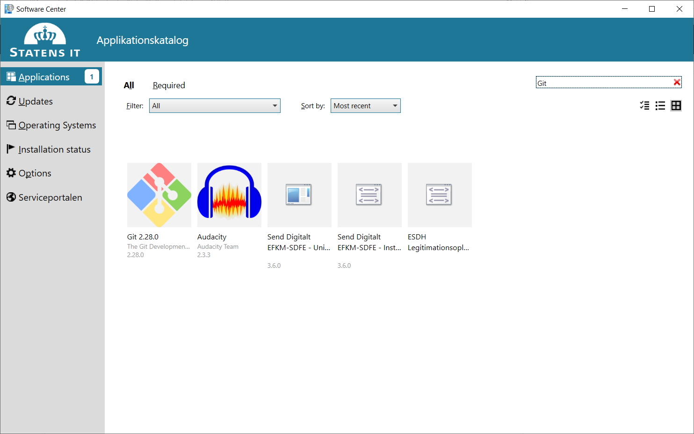
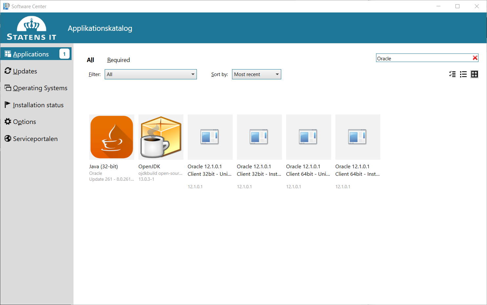
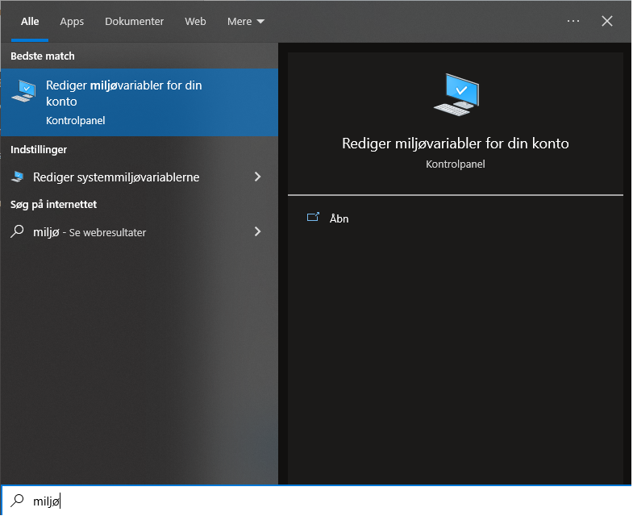
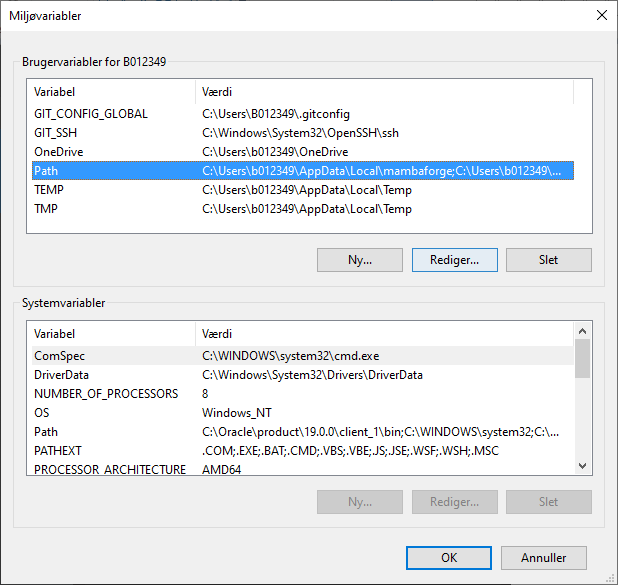
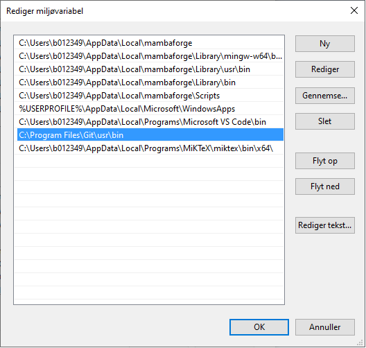

.. _installation:

Installationsvejledning
=======================

Generelt
--------

Denne vejledning fortæller, hvordan man installerer de nødvendige programmer på
éns PC, så man kan tilgå fikspunktregisteret med Python-pakken FIRE.

FIRE skal installeres fra et lokalt Git-arkiv på vores egen PC. Derfor skal vi i
første omgang have et værktøj til at hente kildekoden fra den cenrale placering
på GitHub.

For at forbinde til databasen med fikspunktregisteret skal der også installeres
et værktøj til at lave forbindelsen til databasen fra vores egen PC.

FIRE er bygget i Python, og derfor skal der også installeres en
Python-distribution, herunder et pakkestyringsværktøj, som kan installere
python-pakker eller andre afhængigheder, som FIRE-programmet skal bruge.

For at komme dértil skal følgende installeres fra Software Center:

*   Versionsstyringsværktøjet Git
*   Databaseværktøjet Oracle Instantclient

Dérudover skal følgende installeres manuelt

*   Python-distributionen MambaForge.

Og gennem pakkestyringsværktøjet `mamba` skal de resterende afhængighederne til
FIRE installeres.

Git
---

Installer Git fra Software Centeret. Åbn "Software Center" via Startmenuen. Søg
efter "git" og installér det.

Oracle Instantclient
--------------------

Installer Oracle instantclient fra Software Centeret. Åben "Software Center" via
Startmenuen. Søg efter "Oracle", der dukker flere muligheder op. Den korrekte er
"Oracle Client 19.3 KEFM-SDFE". Versionsnummeret er muligvis anderledes. Er der
flere at vælge mellem tag da den med det højeste versionsnummer. Følg
instruktionerne på skærmen.

MambaForge
----------

FIRE er en Python applikation hvorfor vi skal have Python installeret på
computeren for at kunne afvikle programmet. Til det bruges MambaForge, der
inkluderer Python-fortolker og pakkestyringsværktøjet ``mamba``.

Under SDFIs side for Python-brugere findes en `installationsvejledning
<https://sdfidk.github.io/SDFIPython/setup.html#den-fulde-vejledning>`_. Følg
**Den fulde vejledning** til du kommer til overskriften **Demonstration**.

Når MambaForge er installeret kan du nu i Windows start-menuen finde "Miniforge
Prompt (mambaforge)". Alle efterfølgende kommandoer i denne
installationsvejledning kan afvikles i denne terminal.

.. note::

    Det kan være en fordel at lave en genvej til "Miniforge Prompt" i Windows'
    proceslinjen (åben programmet, højreklik på ikonet i proceslinjen, vælg
    "Fastgør til proceslinje").

Har du sat alle de anbefalede krydser i installations-menuerne, burde du
imidlertid også kunne tilgå ``mamba``-kommandoen fra en hvilken som helst anden
terminal, du ønsker at bruge, da stien til ``mamba`` er føjet til din brugers
PATH-miljøvariabel.

.. note::

    ``mamba``-kommandoen gør funktionelt det samme som ``conda``, men er bare
    hurtigere, end sidstnævnte. Med MambaForge-installationen er det fortsat
    muligt at skrive ``conda``, da den er lavet som et alias, der peger på
    ``mamba``.

    Programmet henter fortsat pakker fra ``conda-forge``, og i en del output er
    der også fortsat henvisninger til kald med kommandoen ``conda``, der som
    nævnt uden problemer kan bruges som alternativ til ``mamba``, hvis man har
    lyst.

Linux kommandolinjeværktøjer
----------------------------

Nogle af os er vant til at bruge kommandolinjen på et et Linuxsystem og mangler
ofte kommandoer som ``ls``, ``cat`` og ``grep``. Herunder vises hvordan man kan
få adgang til dem på sin Windows-maskine.

.. note::

    Dette afsnit er valgfri. Hvis du klarer dig fint med kommandoudvalget under
    Windows er dette ikke nødvendigt og du kan spring til selve installationen af
    FIRE i :ref:`næste afsnit <fire-install>`. 

Linuxkommandoerne følger med Git der blev installeret i et af de tidligere skridt.
Desværre er de ikke som udgangspunkt tilgængelige i vores terminal.
Det kan ændres ved at tilføje deres placering til miljøvariablen ``PATH``.

Start med at åbne start-menuen (tryk på Windows-tasten) og søg efter "miljøvariable".
Vælg derefter "Rediger miljøvariable for din konto" som vist herunder.

Herefter kommer følgende vindue frem med en oversigt over de miljøvariable der
er sat for din konto. Dit indhold er formentligt anderledes end det der ses på
billedet, men "Path" bør være der for alle.

Marker "Path" og tryk på "Rediger..". Det resulterer i en dialogbox hvor der kan
tilføjes mere indhold til miljøvariablen "Path".

Tryk på "Ny" og indtast stien ``C:\Program Files\Git\usr\bin``. Næste gang du
åbner en terminal har du adgang til de mest gængse Linux-kommandoer, prøv fx med
``ls``.

.. _fire-install:
FIRE
----

Nedenfor installerer vi først afhængighederne til FIRE, og dernæst selve programmet.

Byg miljø
+++++++++

Åbn "Miniforge Prompt". Start med at lave en ny mappe til FIRE-koden og download
den med git:

.. code-block::

    (base) C:\>git clone https://github.com/SDFIdk/FIRE.git
    Cloning into 'FIRE'...
    remote: Enumerating objects: 5692, done.
    remote: Counting objects: 100% (62/62), done.
    remote: Compressing objects: 100% (43/43), done.
    remote: Total 5692 (delta 21), reused 54 (delta 18), pack-reused 5630
    Receiving objects: 100% (5692/5692), 27.85 MiB | 14.60 MiB/s, done.
    Resolving deltas: 100% (3518/3518), done.
    Updating files: 100% (225/225), done.

Sørg for at den seneste version af koden bruges:

.. code-block::

    (base) C:\>cd FIRE
    (base) C:\FIRE>git checkout fire-{FIREVERSION}

Opret et isoleret miljø til FIRE (læs eventuelt mere om Python-miljøer `her
<https://sdfidk.github.io/SDFIPython/package.html#reproducerbar-python-miljo-opsaetning>`_):

.. code-block::

    (base) C:\FIRE>mamba env create --file environment.yml
    pkgs/main/win-64                                              No change
    pkgs/main/noarch                                              No change
    pkgs/r/win-64                                                 No change
    pkgs/msys2/win-64                                             No change
    pkgs/r/noarch                                                 No change
    pkgs/msys2/noarch                                             No change
    conda-forge/noarch                                  10.8MB @   3.8MB/s  4.2s
    conda-forge/win-64                                  18.7MB @   3.2MB/s  8.5s

    Looking for: ['click=8.0', 'cx_oracle=8.3', 'fiona=1.8', 'gama=2.15', 'openpyxl=3.0', 'pandas=1.3', 'pyproj=3.3', 'python=3.9', 'sqlalchemy=1.4', 'xmltodict=0.12']

    Transaction

    Prefix: C:\Users\B...\AppData\Local\mambaforge\envs\fire

    Updating specs:

    - click=8.0
    - cx_oracle=8.3
    - fiona=1.8
    - gama=2.15
    - openpyxl=3.0
    - pandas=1.3
    - pyproj=3.3
    - python=3.9
    - sqlalchemy=1.4
    - xmltodict=0.12

    Package                           Version  Build               Channel                  Size
    ------------------------------------------------------------------------------------------------
    Install:
    ------------------------------------------------------------------------------------------------

    + attrs                            22.2.0  pyh71513ae_0        conda-forge/noarch       54kB
    (...)
    + zstd                              1.5.2  h7755175_4          conda-forge/win-64     Cached

    Summary:

    Install: 106 packages

    Total download: 121MB

    ------------------------------------------------------------------------------------------------

    python_abi                                           6.1kB @ 106.3kB/s  0.1s
    (...)
    libspatialite                                       12.0MB @   1.8MB/s  2.3s
    Preparing transaction: done
    Verifying transaction: done
    Executing transaction: done
    #
    # To activate this environment, use
    #
    #     $ conda activate fire
    #
    # To deactivate an active environment, use
    #
    #     $ conda deactivate

Efter endt installation har du nu et miljø kaldet ``fire``, som du kan aktivere
med ``mamba`` eller, som der står i output ovenfor, ``conda``:

.. code-block::

    (base) C:\FIRE>conda activate fire
    (fire) C:\FIRE>

.. note::

    Bemærk, at der efter aktiveringen står ``(fire)``  i starten af
    kommandolinjeprompten.

    Bruger du terminalen **Miniforge Prompt**, så bemærk, at ``(base)``-miljøet
    skifter til ``(fire)``.

    ``(base)``-miljøet er som udgangspunkt kun automatisk aktiveret i
    **Miniforge Prompt**-terminalen.

Konfigurationsfil
+++++++++++++++++

For at FIRE kan forbinde til databasen er det nødvendigt at tilføje en
:ref:`konfigurationsfil <konfigurationsfil>` til systemet hvori adgangsinformation
til databasen er registreret. Placer den i mappen ``C:\Users\<brugernavn>``.

.. note::

  Tag fat i en kollega for at få oplyst brugernavn, adgangskode osv.

Installation
++++++++++++

Med konfigurationsfilen på plads kan vi nu installere FIRE:

.. code-block::

    (fire) C:\FIRE>python -m pip install -e .
    Obtaining file:///C:/FIRE
    Preparing metadata (setup.py) ... done
    Requirement already satisfied: cx_Oracle>=7.0 in c:\users\b...\appdata\local\mambaforge\envs\fire\lib\site-packages (from fire==1.5.0) (8.3.0)
    Requirement already satisfied: sqlalchemy>=1.2.13 in c:\users\b...\appdata\local\mambaforge\envs\fire\lib\site-packages (from fire==1.5.0) (1.4.46)
    Requirement already satisfied: click in c:\users\b...\appdata\local\mambaforge\envs\fire\lib\site-packages (from fire==1.5.0) (8.0.4)
    Requirement already satisfied: click_plugins in c:\users\b...\appdata\local\mambaforge\envs\fire\lib\site-packages (from fire==1.5.0) (1.1.1)
    Requirement already satisfied: greenlet!=0.4.17 in c:\users\b...\appdata\local\mambaforge\envs\fire\lib\site-packages (from sqlalchemy>=1.2.13->fire==1.5.0) (2.0.1)
    Requirement already satisfied: colorama in c:\users\b...\appdata\local\mambaforge\envs\fire\lib\site-packages (from click->fire==1.5.0) (0.4.6)
    Installing collected packages: fire
    Running setup.py develop for fire
    Successfully installed fire-1.5.0

Bekræft at installation er gennemført korrekt

    .. code-block::

        (fire) C:\FIRE>fire --version
        fire, version {FIREVERSION}

.. note::

    Tip: Da ``mamba`` er tilgængeligt lige meget, hvilken mappe, du står i med
    terminalen, er du også uafhængig af mappe-placering, når du skal aktivere
    ``fire``.

    Du kan med andre ord starte i dén mappe, du arbejder i og køre
    aktiverings-kommandoen herfra.

Opdatering
++++++++++

Ved opdatering til en ny version af FIRE køres følgende kommandoer
fra et nyligt åbnet terminalvindue:

.. code-block::

    (base) C:\>cd C:\FIRE
    (base) C:\FIRE>mamba activate fire
    (fire) C:\FIRE>git fetch origin
    (fire) C:\FIRE>git checkout fire-{FIREVERSION}
    (fire) C:\FIRE>mamba env update --file environment.yml

Måske får du undervejs en advarsel om, at ``mamba``/``conda`` skal opdateres:

.. code-block::

    ==> WARNING: A newer version of conda exists. <==
      current version: 4.5.11
      latest version: 4.6.4

    Please update conda by running

        $ conda update -n base -c defaults conda

Gør som foreslået og kør kommandoen ``conda update -n base -c defaults
conda``.

Afinstallering
++++++++++++++

Det kan i visse tilfælde være nødvendigt at afinstallere FIRE. Det gøres i
praksis ved at fjerne miljøet ``fire``:

.. code-block::

    C:\>mamba env remove -n fire

Herefter fjernes git repositoriet med FIRE kildekoden:

.. code-block::

    C:\>rmdir /s C:\FIRE
