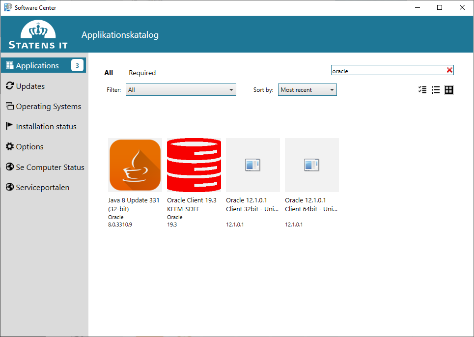

.. _installation:

Installationsvejledning
=======================

Generelt
--------

Som grundlag for alt programmel der installeres i forbindelse med FIRE benyttes
Conda. Conda er et værktøj der oprindeligt er udviklet til
Python-udviklere med henblik på nemt at kunne installere moduler og holde styr
på forskellige versioner af samme modul. I dag er Conda et mere generelt
værktøj som gør det nemt at installere mange forskellige programmer. Læs mere om
Conda `her
<https://docs.conda.io/projects/conda/en/latest/user-guide/getting-started.html>`_

Installation
------------

Der er en række trin der skal gennemføres for at få en komplet installation.
Herunder tager vi dem et ad gangen

Git
++++

Installer Git fra Software Centeret. Åbn "Software Center" via Startmenuen. Søg
efter "git" og installer det.

.. image:: figures/gitfrasoftwarecenter.PNG
  :width: 800
  :alt: Git i softwarecenter

Oracle Instantclient
++++++++++++++++++++

Installer Oracle instantclient fra Software Centeret. Åben "Software Center" via Startmenuen.
Søg efter "Oracle", der dukker flere muligheder op. Den korrekte er
"Oracle 12.1.0.1 Client 64bit - Install" (versionsnummeret er muligvis anderledes). Følg
instruktionerne på skærmen.

Conda
+++++

Download og kør `Miniconda3-latest-Windows-x86_64.exe
<https://repo.anaconda.com/miniconda/Miniconda3-latest-Windows-x86_64.exe>`_.

.. image:: figures/miniconda_start.PNG
  :width: 400
  :alt: Miniconda

Installationen er forholdsvis triviel, og man kan trykke "next" i alle trin og
slutte af med "install". Det indbefatter at Conda kun installeres til den
lokale bruger ("just me") og at ingen af de avancerede muligheder slås til.

.. image:: figures/miniconda_just_me.PNG
  :width: 400
  :alt: Miniconda - just me

.. image:: figures/miniconda_bibliotek.PNG
  :width: 400
  :alt: Miniconda bibliotek

.. image:: figures/miniconda_advanced.PNG
  :width: 400
  :alt: Miniconda advanced

Når Conda er installeret kan du nu i start menuen finde "Anaconda Prompt
(miniconda3)" Alle efterfølgende kommandoer i denne installationsvejledning skal
afvikles i denne terminal. Det anbefales at lave en genvej til "Anaconda Prompt"
i Windows' proceslinjen (åben programmet, højreklik på ikonet i proceslinjen,
vælg "fastgør til proceslinje").

FIRE
+++++++++++++++++

.. note::

    Det er for nuværende mere kompliceret at installere koden end det bliver i fremtiden.
    Hav tålmodighed, der er smartere løsninger på vej!

Åbn "Anaconda Prompt". Start med at lave en ny mappe til FIRE koden og download
den med git::

    > mkdir C:\fire
    > cd C:\fire
    > git clone https://github.com/Kortforsyningen/FIRE.git

.. image:: figures/anacondaprompt-hent-fire.PNG
  :width: 800
  :alt: FIRE i anacondaprompt

Initialiser et "conda environment" til FIRE::

    > cd FIRE
    > conda env create --file environment.yml

Vær tålmodig, det kan godt tage lang tid.

.. image:: figures/anacondaprompt-conda-env-create.PNG
  :width: 800
  :alt: FIRE i anacondaprompt - environment

Undervejs ser det således ud:

.. image:: figures/anacondaprompt-undervejs-i-installation-af-fire-env.PNG
  :width: 800
  :alt: FIRE i anacondaprompt - undervejs

Gør som ``conda`` siger og aktiver dit nye "fire environment"::

    > conda activate fire

.. image:: figures/anacondaprompt-færdig.PNG
  :width: 800
  :alt: FIRE i anacondaprompt - færdig

Installer FIRE::

    > pip install -e .

Konfigurationsfil
.................

For at FIRE kan forbinde til databasen er det nødvendigt at tilføje en
konfigurationsfil til systemet hvori adgangsinformation til databasen er
registreret. Konfigurationsfilen er en INI fil, der er struktureret på følgende
måde

.. code-block:: ini

    [connection]
    password = <adgangskode>
    username = <brugernavn>
    hostname = <netværksadresse>
    database = <databasenavn>
    service = <servicenavn>

.. note::

    Tag fat i en kollega for at få oplyst brugernavn, adgangskode osv.

Under Windows placeres konfigurationsfilen i en af følgende stier::

    C:\Users\<brugernavn>\fire.ini
    C:\Users\Default\AppData\Local\fire\fire.ini

og på et UNIX-baseret system placeres filen et af følgende steder::

    home/<brugernavn>/fire.ini
    home/<brugernavn>/.fire.ini
    /etc/fire.ini

Flame - QGIS plugin
+++++++++++++++++++

.. note::

    Installationsvejledning til Flame afventer beslutninger om deployment
    procedurer.
