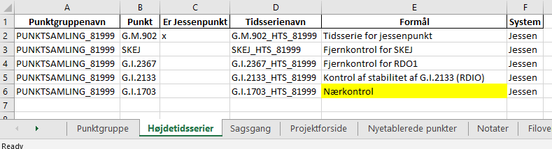

.. _punktsamlinger:

Arbejde med højdetidsserier og punktsamlinger i FIRE
====================================================
En højdetidsserie er en samling af koter, som alle er målt til det samme punkt til
forskellige tidspunkter, og som er givet i det samme *højdesystem*. Når hver kote i
tidsserien er beregnet ved fastholdelse af det samme punkt og kote kaldes koterne i
tidsserien for *jessenkoter* og tidsseriens højdesystem siges at være et *lokalt
højdesystem*. Det fastholdte punkt kaldes for *jessenpunktet* og jessenpunktets fastholdte
kote kaldes *referencekoten*.

En samling af højdetidsserier, som alle har samme jessenpunkt og referencekote, kaldes en
*punktsamling* eller *punktgruppe*.

.. note::
    Vær opmærksom at højdetidsseriernes jessenkoter ofte bare kaldes koter. Tilsvarende kaldes
    referencekoten ofte bare for *jessenkoten*!

Arbejdet med højdetidsserier kan inddeles i kategorierne vedligehold og analyse.
Vedligehold af tidsserier indebærer primært opmåling af punktgrupper og efterfølgende
beregning af nye koter til tidsserierne. Når nye punkter etableres, fx fordi et andet
punkt i punktgruppen er gået tabt eller en ny sikringsgruppe skal anlægges, vil der også
ligge noget vedligehold i at indmåle punkterne og efterfølgende oprette nye tidsserier i
databasen.

Højdetidsserieanalyse bruges som værktøj til at støtte op om beslutninger angående den
geodætiske infrastruktur. Analyserne foretages på baggrund af det data som ligger i FIRE
og gør det muligt at identificere lokale bevægelser af punkterne i punktgruppen. Dette
bruges igen til fx at dokumentere stabiliteten af vores CORS-stationer, eller træffe
beslutning om hvorvidt et 5D-punkt skal indgå i en geoidetilpasning.

Man bruger programmet :ref:`fire_ts_analyse_hts` til at analysere Højdetidsserier.
Programmet fungerer i høj grad på samme måde som programmet til GNSS-tidsserier. For
detaljer om beregningen af lineære fit og statistiske parametre henvises derfor til
beskrivelsen af :ref:`fire_ts_analyse-gnss`.

De følgende afsnit gennemgår nogle typiske vedligeholdelsesopgaver som FIRE nu
understøtter, herunder:

- at oprette og lukke punktgrupper
- tilføje nye punkter til punktgrupper
- beregne og indsætte nye koter til tidsserier

.. note::

    Der er ikke ændret noget ved det almindelige nivellement-workflow. Det er altså ikke
    nødvendigt at læse videre hvis man ikke har brug for at arbejde med tidsserier!

.. _ts_vedligehold:
Vedligehold af punktsamlinger og tidsserier
-------------------------------------------
Vedligehold og opdatering af punktgrupper og højdetidsserier er indbygget i
:ref:`kommandolinjeprogrammer_niv`-modulet. Før man begiver sig ud i at vedligeholde
tidsserier i FIRE, anbefales det derfor at man er bekendt med den almindelige
funktionalitet som **niv**-modulet tilbyder. Det vil bl.a. sige at man bør være
komfortabel med at arbejde med nivellement-sager i **niv**-modulets sagsregneark.

Funktionaliteten i sagsregnearket er blevet udvidet med fanerne **Punktgruppe** og
**Højdetidsserier**. Disse faner oprettes først ved kald af én af kommandoerne ``fire niv
opret-punktsamling`` eller ``fire niv udtræk-punktsamling``.

En oversigt og forklaring af de to faners indhold ses nedenfor. Bemærk at indholdet i
tabellerne blot er test-eksempler.

  .. image:: images/eksempel_punktgruppe.png

| **Punktgruppenavn**: Punktgruppens navn. Skal være unikt. Default-formen er ``PUNKTSAMLING_<jessennr>``
| **Jessenpunkt**: Punkgruppens jessenpunkt, angivet med dets kanoniske ident.
| **Jessennummer**: Punkgruppens jessenpunkt, angivet med dets Jessennummer.
| **Jessenkote**: Punktgruppens referencekote.
| **Formål**: Fritekstfelt, som angiver punktgruppens formål.

  .. image:: images/eksempel_højdetidsserie.png

| **Punktgruppenavn**: Punktgruppen, som højdetidsserien hører under.
| **Punkt**: Højdetidsseriens punkt.
| **Er Jessenpunkt**: Angiver om tidsserien tilhører punktgruppens jessenpunkt. Denne
  kolonne er til ren information og kan hjælpe med at danne overblik, når listen af
  højdetidsserier er lang.
| **Tidsserienavn**: Højdetidsseriens navn. Skal være unikt. Default-formen er ``<ident>_HTS_<jessennr>``
| **Formål**: Fritekstfelt, som angiver højdetidsserierns formål.
| **System**: Tidsseriens højdesystem.

.. _opret_ps:
Opret ny punktsamling
---------------------
* Opret ny sag og tilhørende sagsark:

.. code-block::

    fire niv opret-sag MIN_SAG

* Opret punktsamling i sagsarket og rediger oplysningerne

.. code-block::

    fire niv opret-punktsamling MIN_SAG --jessenpunkt 81999

.. note::
    Hvis jessenpunktet ikke har et jessennummer skal det oprettes først. Se :ref:`opret_jessenpunkt`.

Der oprettes herefter to nye faner i sagsarket: **Punktgruppe** og **Højdetidsserier**.
Oplysningerne i de to faner redigeres indtil man er klar til at lægge dem i databasen.

* Rediger punktgruppe-fanen

  Det er muligt at redigere i punktgruppenavnet og formål. Det anbefales dog at beholde
  default-navnet ``PUNKTSAMLING_81xxx``

  .. image:: images/opret_punktgruppe_før.png

  .. image:: images/opret_punktgruppe_efter.png

* Rediger højdetidsserier-fanen

  Den første tidsserie tilhører jessenpunktet og oprettes i arket automatisk. Per
  definition er den konstant (den indeholder kun referencekoten), og er som sådan ret
  intetsigende. Dog er den af tekniske årsager nødvendig.

  .. image:: images/opret_højdetidsserie_før.png

  * Tilføj de ønskede punkter. Husk at angive punktgruppen i første kolonne.
  * Giv tidsserierne et sigende navn. Det anbefales kraftigt at bruge default-formen
    ``<ident>_HTS_<jessennummer>``

  .. image:: images/opret_højdetidsserie_efter.png

.. tip::
    | For at spare lidt tid med at indtaste værdierne i højdetidsserier-fanen kan man med
      fordel bruge parameteren ``--punkter``:

    .. code-block::

        fire niv opret-punktsamling MIN_SAG --jessenpunkt 81999 --punkter SKEJ,RDIO,RDO1

    | hvilket resulterer i flg:

    .. image:: images/opret_højdetidsserie_tip.png

    | Dette virker også med udtræk af punktsamlinger:

    .. code-block::

        fire niv udtræk-punksamling MIN_SAG --jessenpunkt 81999 --punkter SKEJ,RDIO,RDO1

* Til sidst lægges punktsamling og højdetidsserier i databasen::

      fire niv ilæg-punktsamling MIN_SAG
      fire niv ilæg-tidsserie MIN_SAG

.. _opret_jessenpunkt:
Opret nyt jessennummer
.......................
Før et punkt kan blive brugt som jessenpunkt, skal punktet have et jessennummer.  Dette
gøres ved at indsætte attributten ``NET:jessen`` og angive det nye jessennummer med
``IDENT:jessen`` via de gængse kommandoer :ref:`udtræk_revision` og :ref:`ilæg_revision`.

.. note::

  Bemærk at jessennummeret skal være unikt (der må ikke være andre punkter med samme
  jessennummer). Som det er nu skal man selv indtaste det nye jessennummer. En oversigt
  over alle punktsamlinger og de tilhørende jessennumre som allerede er i brug kan fås med
  :ref:`info_punktsamling`.

.. _opret_ts:
Opret ny tidsserie i en punktsamling
------------------------------------
For at oprette en ny tidsserie i en punktsamling gøres følgende::

    fire niv udtræk-punktsamling MIN_SAG --punktsamlingsnavn PUNKTSAMLING_81999 --punkter G.I.1703

hvor ``--punkter`` angiver en kommasepareret liste, af de punkter som skal have en ny
tidsserie.

.. note::

  Hvis man i sagsarket allerede har indlæst punkter med ``læs-observationer`` eller
  ``udtræk-observationer``, således at fanen **Punktoversigt** er til stede, så kan man
  med parameteren ``--punktoversigt`` fortælle programmet, at det skal oprette nye
  tidsserier for alle punkterne i punktoversigten. Fx::

    fire niv udtræk-punktsamling MIN_SAG --punktsamlingsnavn PUNKTSAMLING_81999 --punktoversigt

Herefter kan formål for tidsserien rettes i fanen Højdetidsserier. Som det også er beskrevet under
:ref:`opret_ps`, så anbefales det at man så vidt muligt bruger tidsseriens
default-navn: ``<ident>_HTS_<jessennummer>``

Når man er tilfreds, lægges rettelserne i databasen::

    fire niv ilæg-punktsamling MIN_SAG
    fire niv ilæg-tidsserie MIN_SAG

Rediger eksisterende punktsamlinger og tidsserier
-------------------------------------------------
Der er begrænset mulighed for at redigere metadata for punktsamlinger og tidsserier, idet
kun formålet kan redigeres.
Idet det antages at der er oprettet en sag i forvejen, gøres følgende::

    fire niv udtræk-punktsamling MIN_SAG PUNKTSAMLING_81999

Rediger formål for punktsamlinger og tidsserier i sagsarket. Derefter ilægges ændringerne::

    fire niv ilæg-punktsamling MIN_SAG
    fire niv ilæg-tidsserie MIN_SAG

.. _opdater_ts:
Opdatering af højdetidsserier
-----------------------------
Opdatering af tidsseriekoter følger overordnet samme fremgangsmåde som ved opdatering af
almindelige DVR90-koter, med få undtagelser.

Det følgende springer let over de dele af beregningsflowet som der ikke er ændringer til,
og med nedslag de steder hvor der er undtagelser.

::

    fire niv opret-sag MIN_SAG
    fire niv læs-observationer MIN_SAG --kotesystem jessen

Normalt opbygges Punktoversigten med ``læs-observationer`` ved anvendelse af hvert
observeret Punkts seneste *DVR90-kote*. Ved anvendelse af det nye flag ``--kotesystem
jessen`` fortæller man nu programmet, at Punktoversigten skal opbygges ved hjælp af hvert
Punkts seneste *jessenkote* i stedet. Denne kote bliver brugt til at vise koteændringer og
opløft, når man har lavet en beregning.

.. note::

  Her skal man lige være opmærksom. Det er nemlig muligt for et punkt at indgå i flere
  Punktsamlinger (med forskellige jessenpunkter) og dermed have flere Højdetidsserier. *Den viste kote er den nyeste
  jessenkote iblandt alle punktets Højdetidsserier.* Dette kan lede til at koteændring og
  opløft senere kan komme til at se lidt underlige ud. Der er senere, i ``regn``, mulighed for at få
  plottet tidsserierne med de nyberegnede koter vist i forlængelse.

  Det kan desuden ske, at man har opmålt nogle punkter, som slet ikke har en
  Højdetidsserie. I dette tilfælde vil de se ud på samme måde som nyetablerede punkter,
  altså med kote og spredning u-udfyldt.

Herefter skal man vælge et fastholdt punkt og dertil en fastholdt kote. *Dette skal være
et registeret jessenpunkt og referencekote*. Dette gøres ved først at udtrække
punktsamlingen, som er blevet opmålt::

    fire niv udtræk-punktsamling MIN_SAG --punktsamlingsnavn "PUNKTSAMLING_81xxx"

Resultaterne af udtrækningen skrives til sagsarket i to nye faner **Punktgruppe** og
**Højdetidsserier**.

.. note::

  I ``udtræk-punktsamling`` kan du i stedet for  ``--punktsamlingsnavn "PUNKTSAMLING_81xxx"``,
  vælge at bruge ``--jessenpunkt 81xxx``

  Dette udtrækker alle Punktsamlinger der har punktet 81xxx som jessenpunkt. Man behøver
  desuden ikke at bruge jessenpunktets jessennummer. Alle jessenpunktets gyldige IDENT'er
  kan bruges, herunder lands- og GI-nummer.

Herefter sættes, som ved en normal beregning, et "x" ved jessenpunktet som skal fastholdes, og *ved
jessenpunktets kote skriver man den jessenkote som står i Punkgruppe-fanen.*

.. image:: images/indsæt_jessenkote.gif

Når man har valgt et fastholdt jessenpunkt og referencekote, kører man beregningerne som man plejer::

    # kontrol
    fire niv regn
    # endelig
    fire niv regn

Hvis man vil, er der tilføjet parameteren ``--plot`` til ``regn`` kommandoen. Denne
giver mulighed for at se et plot af de tidsserier man har udtrukket, med de nyberegnede
koter vist i forlængelse. Det skal understreges, at kun de tidsserier som fremgår af fanen
**Højdetidsserier** vil blive plottet. Punkter i beregningen, som ikke har en
højdetidsserie, og som derfor ikke fremgår af fanen **Højdetidsserier**, vil altså ikke
blive plottet.

Beregningen afsluttes også som man plejer::

    fire niv ilæg-observationer
    fire niv ilæg-nye-koter

Der er ikke nye inputs til disse to kommandoer.

**Vigtigt:** ``ilæg-nye-koter`` kigger nu på kolonnen **System** i fanen **Endelig beregning**. Hvis der her står "Jessen", så
prøver programmet at finde en Højdetidsserie ovre i **Højdetidsserier**-fanen, som koten skal knyttes
til. Hvis der ikke kan findes en højdetidsserie for et punkt, vil programmet brokke sig. Man kan
derefter gøre én af to ting:

  - Oprette tidsserier for de punkter som ikke har én, i den korrekte punktsamling. (Se
    beskrivelse i :ref:`opret_ts`. Brug i ``udtræk-punktsamling`` med fordel
    parameteren ``--punktoversigt``.)

  - Udelade publikation. Sæt "x" i kolonnen ud for de pågældende punkter

Skift af jessenpunkt
--------------------
Sommetider er det nødvendigt at udskifte jessenpunktet for en punktsamling. Det kan fx være fordi
jessenpunktet konstateres ustabilt eller at jessenpunktet er gået tabt.

Der findes to måder at dette kan udføres på: en quick'n'dirty (transformation) og en stringent (genberegning).

Quick'N'Dirty
.............
Den hurtige og beskidte metode er til hurtige ad hoc beregninger eller analyser, hvor man
"transformerer" tidsseriekoterne fra det gamle, lokale højdesystem til det nye, lokale højdesystem.

Dette er fx praktisk i tilfældet hvor to tidsserier har forskellige bevægelser ift.
jessenpunktet. Her kan det være svært rent grafisk at anskue de to punkters bevægelse ift.
hinanden, hvorfor det kan hjælpe at ophøje det ene punkt til jessenpunkt, hvis bevægelse i
sit eget system pr. definition er 0.

Der tages udgangspunkt i den "gamle" tidsserie for det punkt som skal være det nye
jessenpunkt. *Denne tidsserie trækkes simpelthen bare fra de andre tidsserier i
punktsamlingen*. Dette kræver at tidsserierne er beregnet til de samme tidspunkter som det
nye jessenpunkt.

Denne operation er faktisk ikke *så* dirty, idet det faktisk giver de samme koter som
hvis man lavede en genberegning med et nyt fastholdt jessenpunkt. Dog vil de estimerede
spredninger ikke blive transformeret, hvorfor denne metode ikke bør (eller kan) anvendes til
tidsserier som skal lægges i databasen.

.. note::

    Dette er pt. ikke implementeret i FIRE. Vil man anvende denne metode kan det relativt
    let gøres ved at udtrække de tidsserier man er interesseret i med ``fire ts hts``, og
    derefter selv trække tidsserierne fra hinanden, eksempelvis i excel.

.. tip::

    Vil man være endnu mere dirty, så kan man interpolere imellem
    tidspunkterne i det nye jessenpunkts tidsserie for at kunne transformere data til de
    tidspunkter hvor tidsserien for det nye jessenpunkt ikke er blevet beregnet.

Den stringente
..............

I FIREs datamodel, er jessenpunktet definerende for en punktsamling, og derfor kan man
principielt ikke *skifte* jessenpunktet. Dog er det muligt at oprette en ny punktsamling
med det nye jessenpunkt, og som indeholder de samme punkter som den gamle punktsamling.

Derefter er det nødvendigt at genberegne tidsserierne, skridt for skridt, og ved hvert
skridt anvende det samme sæt af observationer som blev brugt til de gamle tidsserier, og
selvfølgelig med fastholdelse af det nye jessenpunkt.

For at kunne genskabe alle tidsskridt i de gamle tidsserier kræves at det nye jessenpunkt
har været opmålt i de samme kampagner som det gamle jessenpunkt.

**Fremgangsmåde:**

#. Giv nyt jessenpunkt et jessennummer med ``fire niv udtræk-revision`` og ``fire niv ilæg-revision``
#. Opret ny punktsamling med det nye jessenpunkt
#. Tilføj punkter og tidsserier til punktsamlingen
#. For hver tidspunkt i de gamle tidsserier:
    - Udtræk relevante observationer
    - Følg det gængse niv-workflow for beregning og ilægning af tidsseriekoter, som
      beskrevet i :ref:`opdater_ts`

.. tip::

    Step 2-3 gøres nemmest ved at udtrække den gamle punktsamling med ``fire niv
    udtræk-punktsamling`` og derefter redigere jessenpunkt, punktsamlingsnavn og formål og ilægge
    med ``fire niv ilæg-punktsamling``
