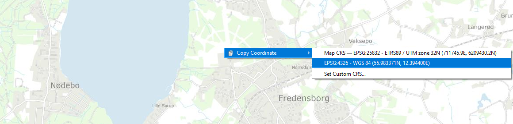
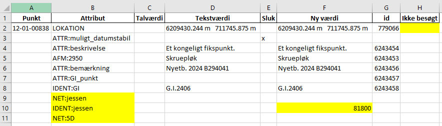
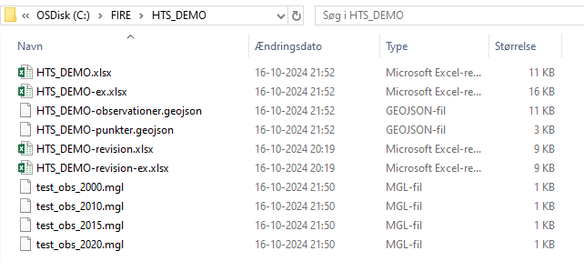
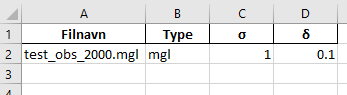
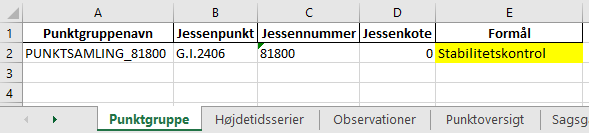
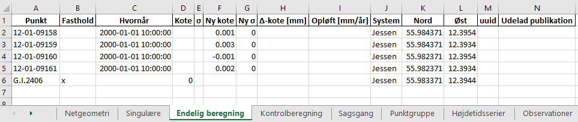

.. _htscase:

Case: Højdetidsserier
---------------------

Velkommen til denne lille case, hvor du vil blive klogere på at arbejde med
højdetidsserier i FIRE. Undervejs vil vi gennemgå en tænkt livscyklus for et opdigtet
5D-punkt i FIRE. Herunder bl.a. etablering af punkter og vedligeholdelsen af tidsserier
for en punktgruppe nær 5D-punktet.

Det er en fordel hvis du er bekendt med det eksisterende nivellement-workflow, som udføres
ved hjælp af et sagsregneark i Excel. Dog er vejledningen forholdsvist udførlig, så det
burde være muligt at kunne følge med alligevel.

Hvis du undervejs har brug for yderligere hjælp eller forklaring, så er der under
:ref:`punktsamlinger` beskrevet mange af de samme processer som vi kommer til at gennemgå
her. Det anbefales at man starter med at læse indledningen dér, som gør det klart hvad der
menes med mange af de begreber der bruges.

Derudover kan du altid prøve at kigge i de enkelte kommandoers hjælpetekst med flaget
``--help`` eller slå op under :ref:`kommandolinjeprogrammer_niv` eller
:ref:`kommandolinjeprogrammer_info`.

Hent seneste version af FIRE
++++++++++++++++++++++++++++

For at følge trinnene i casen skal du minimum have version ``1.8.0`` af FIRE. Følg
vejledningen om :ref:`opdatering` af FIRE til ny version, og kom tilbage hertil når du er
færdig.
Tjek bagefter, at du har FIRE-version ``1.8.0`` eller højere installeret::

    (fire) C:\FIRE>fire --version
    fire, version 1.8.0

.. _ret_default_db:
Ret default databaseforbindelsen
++++++++++++++++++++++++++++++++

.. warning::

  Inden du begynder, er det vigtigt at sørge for, at du ikke forbinder til
  produktionsdatabasen ved et uheld. Gør derfor følgende::

  Find din FIRE-konfigurationsfil ``fire.ini`` og ret default databaseforbindelsen til
  ``test`` i stedet for ``prod``. **Dette gør så du slipper for at skrive** ``--db test``
  **efter hver eneste kommando i denne demo case.**
  I toppen af filen skal der stå (uden de tre ``...``)::

    [general]
    default_connection = test
    ...

  Kontrollér desuden længere nede i ``fire.ini`` at test-databaseforbindelsen er som følger
  (med password og username udfyldt)::

    [test_connection]
    password = ***
    username = ***
    hostname = exa-x10-r2-c1-scan.prod.sitad.dk
    service = FIRETEST.prod.sitad.dk
    schema = fire_adm

  Kør FIRE-kommandoen ``fire config`` for at tjekke, at FIRE kan finde din
  konfigurationsfil. Kontrollér at oplysningerne står som beskrevet ovenfor.

  Når du er færdig med denne demo kan du, hvis du vil, rette default-forbindelsen tilbage
  til ``prod``.

Så går vi i gang!

Opret sag
++++++++++
Opret en mappe et passende sted til denne case, og stil dig i den. Kald den fx ``HTS_DEMO``.

Opret en sag, og kald også den for ``HTS_DEMO``. Giv den evt. også en beskrivelse::

    fire niv opret-sag HTS_DEMO "En sag til min demo-case om Højdetidsserier"

Du vil blive spurgt, om du er sikker på om sagen skal oprettes i databasen. **Dobbelttjek
at du opretter sagen i test-databasen**. Hvis du er ved at oprette sagen i prod, skriv da ``nej``, og følg trinnene under :ref:`ret_default_db`.

::

    Sags/projekt-navn: HTS_DEMO  (2627a3f1-13a4-40bc-8a71-73a83ce4003c)
    Sagsbehandler:     B294041
    Beskrivelse:       En sag til min demo-case om Højdetidsserier
    Opretter ny sag i test-databasen - er du sikker?  (ja/NEJ):
    ja
    Gentag svar for at bekræfte (ja/NEJ)
    ja
    Sag 'HTS_DEMO' oprettet
    Skriver sagsregneark 'HTS_DEMO.xlsx'
    Filen 'HTS_DEMO.xlsx' findes ikke.
    Skriver: {'Nyetablerede punkter', 'Filoversigt', 'Parametre', 'Sagsgang', 'Notater', 'Projektforside'}
    Til filen 'HTS_DEMO.xlsx'
    Færdig!

Info om sagen kan til enhver tid ses ved at slå dens databaseid op (find det i output fra
forrige kommando, eller i sagsarket under fanen **Sagsgang**)::

    fire info sag 2627a3f1-13a4-40bc-8a71-73a83ce4003c
    >>
    ------------------------- SAG -------------------------
    Sagsid        : 2627a3f1-13a4-40bc-8a71-73a83ce4003c
    Oprettet      : 2024-10-16 15:29:27.054865
    Sagsbehandler : B294041
    Status        : Aktiv
    Beskrivelse   :

        HTS_DEMO: En sag til min demo-case om Højdetidsserier

Opret dit eget 5D-punkt
+++++++++++++++++++++++
Som det første, skal vi have oprettet jessenpunktet for vores nye punktgruppe. Dette gør
vi ved først at oprette det som et almindeligt punkt, og derefter tildele det et jessennummer.

Åbn QGIS eller lignende, og find et egnet sted i Danmark. Træk koordinaterne ud. I QGIS
kan det gøres med et enkelt højreklik på kortet:

Skriv koordinaterne ind i sagsarkets fane **Nyetablerede punkter**. Udfyld
**Fikspunktstype** og **Afmærkning** som vist. I de andre felter **Foreløbigt navn** og **Beskrivelse** kan du skrive hvad du vil.

.. image:: figures/nyetableret_5d.PNG

Læg punktet i databasen, ved at lukke sagsarket og køre følgende::

    fire niv ilæg-nye-punkter HTS_DEMO

Åbn sagsarket igen og se at punktet nu er lagt i databasen og har fået tildelt et
landsnummer. Træk punktinfo ud via det nye landsnummer, og se at punktet også har fået et
nyt GI-nummer. Vi vil fremover bruge GI-nummeret frem for landsnummeret.

::

    fire info punkt 12-01-00838
    >>
    --------------------------------------------------------------------------------
    PUNKT G.I.2406
    --------------------------------------------------------------------------------
    Lokation                    POINT (12.3944 55.983371)
    Oprettelsesdato             2024-10-16 16:45:58.544396
    AFM:2950                    Skruepløk
    ATTR:beskrivelse            Et kongeligt fikspunkt.
    REGION:DK
    ATTR:bemærkning             Nyetb. 2024 B294041
    ATTR:GI_punkt
    IDENT:GI                    G.I.2406
    IDENT:landsnr               12-01-00838

    --- KOORDINATER ---

Tildel Jessennummer
+++++++++++++++++++
Nu skal punktet oprettes som jessenpunkt og tildeles et jessennummer. Udtræk
revisions-arket for punktet via det nye GI-nummer::

    fire niv udtræk-revision HTS_DEMO G.I.2406

Udtræk derefter alle nuværende punktsamlinger for at få en liste over jessennumre som allerede er i brug::

    fire info punktsamling
    >>
    Navn                                Jessenpunkt  Antal punkter  Antal tidsserier
    ----------------------------------  -----------  -------------  ----------------
    PUNKTSAMLING_81001                  81001        25             0
    Punktsamling for Jessenpunkt 81001  81001        59             59
    Punktsamling for Jessenpunkt 81002  81002        50             50
    ...
    ...
    Punktsamling for Jessenpunkt 81158  81158        28             28
    TEST_NY_PKTGRUPPE                   81500        5              0
    TEST_TOM_PKTGRUPPE                  81500        4              4
    TEST_SPARRING                       81600        10             12
    PUNKTSAMLING_81999                  81999        5              4

Vælg et nyt jessennummer, som ikke fremgår af listen (kolonnen "Jessenpunkt"), og skriv det ind i revisionsarket som vist:

Husk at slette "x" fra kolonnen **Ikke besøgt**. Luk revisions- og sagsarket, og ilæg de nye attributter::

    fire niv ilæg-revision HTS_DEMO

Tjek at punktet har fået tildelt jessennummer og har attributterne ``NET:jessen`` og ``NET:5D``::

    fire info punkt G.I.2406
    >>
    --------------------------------------------------------------------------------
    PUNKT G.I.2406
    --------------------------------------------------------------------------------
    ...
    NET:jessen
    IDENT:jessen                81800
    NET:5D
    ...

Opret sikringspunkter
+++++++++++++++++++++

Nu opretter vi 4 sikringspunkter omkring det nye 5D-punkt. Du kan gøre som før, ved selv
at indtaste nogle tilfældige koordinater ind i fanen **Nyetablerede punkter**. Alternativt
burde følgende tabel kunne kopieres ind i arket:

.. list-table::
    :widths: 25 25
    :header-rows: 0

    * - =C$2+0.001
      - =D$2+0.001
    * - =C$2+0.001
      - =D$2-0.001
    * - =C$2-0.001
      - =D$2+0.001
    * - =C$2-0.001
      - =D$2-0.001

Dette gør så de 4 punkter oprettes NV, NØ, SV og SØ for jessenpunktet.

.. image:: figures/nyetableret_sikringsgruppe.PNG

Ilæg punkterne::

    fire niv ilæg-nye-punkter HTS_DEMO

Tjek at punkterne er oprettet korrekt. Du kan fx gøre flg:

* Find de nye landsnumre i sagsarket
* Slå punkterne op med ``fire info punkt``
* Kør ``fire niv læs-observationer HTS_DEMO`` Der er selvfølgelig ikke nogen observationer
  endnu, men denne kommando laver også nogle geojson-filer som vi kan trække ind i QGIS.
* Find den oprettede geojson-fil, fx ``HTS_DEMO-punkter.geojson`` og træk den ind i QGIS::

.. image:: figures/indtræk_geojson.gif

Første opmåling
+++++++++++++++
Der laves nu den første opmåling af vores punktgruppe. Først laver vi nogle indledende
øvelser for at simulere nogle nivellement-observationer, foretaget igennem 2 årtier.

Hent de 4 test-observationsfiler og gem dem i din test-mappe: :download:`test_obs_mgl.zip <test_obs_mgl.zip>`

I filerne er gemt de observationer vi skal bruge til at udjævne og generere tidsserier i
FIRE. Når du har hentet filerne, skulle din mappestruktur gerne se nogenlunde sådan ud:

Åbn gerne nogle af mgl-filerne. Læg mærke til de generiske punktnavne som indgår::

    Jessenpunkt, Punkt-A, Punkt-D, Punkt-C, Punkt-D

Disse vil vi i det følgende, via lidt søg-og-erstat gymnastik, erstatte med identerne for
de punkter vi lige har oprettet.

Her er skabelonen for søg-og-erstat kommandoerne. Kør alle kommandoerne, hvor du erstatter
punktnavnene med dine egne punkter::

    sed -i 's/Jessenpunkt/MitJessenpunkt/g' test_obs_*.mgl
    sed -i 's/Punkt-A/MitFørstePunkt/g' test_obs_*.mgl
    sed -i 's/Punkt-B/MitAndetPunkt/g' test_obs_*.mgl
    sed -i 's/Punkt-C/MitTredjePunkt/g' test_obs_*.mgl
    sed -i 's/Punkt-D/MitFjerdePunkt/g' test_obs_*.mgl

Her et eksempel på hvordan søg-og-erstat kommandoerne kan se ud::

    sed -i 's/Jessenpunkt/G.I.2406/g' test_obs_*.mgl
    sed -i 's/Punkt-A/12-01-09158/g' test_obs_*.mgl
    sed -i 's/Punkt-B/12-01-09159/g' test_obs_*.mgl
    sed -i 's/Punkt-C/12-01-09160/g' test_obs_*.mgl
    sed -i 's/Punkt-D/12-01-09161/g' test_obs_*.mgl

Indlæs nu observationerne fra den første mgl-fil. Under fanen **Filoversigt** i sagsarket skriver du følgende:

Luk arket og indlæs observationerne med::

    fire niv læs-observationer HTS_DEMO --kotesystem Jessen

Parameteren ``--kotesystem Jessen``, gør så programmet forsøger at finde punkternes seneste
jessenkote samt udfylder kolonnen **System** for dig. Hvis du glemmer at bruge denne
parameter kan du altid bare indtaste det i arket manuelt.

Tjek at punkterne nu står i fanen **Punktoversigt**. Du er nu klar til at oprette en punktgruppe og tidsserier.

.. image:: figures/punktoversigt_1.PNG

Opret punktgruppe og tidsserier
+++++++++++++++++++++++++++++++

Kør følgende kommando. Dette opretter fanerne **Punktgruppe** og **Højdetidsserie** i
sagsarket.

::

    fire niv opret-punktsamling HTS_DEMO --jessenpunkt 81800 --punktoversigt

Åbn sagsarket og rediger formål for punktsamlingen og de 5 tidsserier. Formålene er
fritekst-felter som man kan bruge til fx at give information om hvad punktgruppen og
tidsserierne skal bruges til. De må ikke lades være tomme, men må gerne være kortfattede:

.. image:: figures/højdetidsserier_fane_1.PNG

Læg mærke til, at referencekoten for punktsamlingens jessenpunkt (kolonnen **Jessenkote**)
er angivet til 0. Denne kolonne er kun til info, og ignoreres ved ilægning af
punktsamlingen. Nye punktsamlinger oprettes altid med referencekoten 0.

Ilæg Punktsamlingen og Højdetidsserierne::

    fire niv ilæg-punktsamling HTS_DEMO
    fire niv ilæg-tidsserie HTS_DEMO

Tjek at punktsamlingen og dens tidsserier er lagt i databasen::

    fire info punktsamling PUNKTSAMLING_81800
    >>
    ------------------------- PUNKTSAMLING -------------------------
    Navn          : PUNKTSAMLING_81800
    Formål        : Stabilitetskontrol
    Jessenpunkt   : G.I.2406
    Jessennummer  : 81800
    Jessenkote    : 0 m
    Antal punkter : 5
    --- Punkter ---
    G.I.2406
    12-01-09158
    12-01-09159
    12-01-09160
    12-01-09161
    --- Tidsserier ---
    Navn                                      Antal datapunkter  Type    Referenceramme
    ----------------------------------------  -----------------  ------  ------------------
    G.I.2406_HTS_81800                        0                  Højde   Jessen
    12-01-09161_HTS_81800                     0                  Højde   Jessen
    12-01-09160_HTS_81800                     0                  Højde   Jessen
    12-01-09159_HTS_81800                     0                  Højde   Jessen
    12-01-09158_HTS_81800                     0                  Højde   Jessen

Ret formål
++++++++++
Du har indset, at "Stabilitetskontrol" var en lidt for intetsigende beskrivelse, og beslutter dig for at rette det.

Gå ind i sagsarket og ret punktsamlingens formål til noget andet. Derefter kører du samme kommandoer som før::

    fire niv ilæg-punktsamling HTS_DEMO
    fire info punktsamling PUNKTSAMLING_81800
    >>
    ------------------------- PUNKTSAMLING -------------------------
    Navn          : PUNKTSAMLING_81800
    Formål        : Kontrol af stabilitet
    Jessenpunkt   : G.I.2406
    Jessennummer  : 81800
    Jessenkote    : 0 m
    ...

.. _forste_opmaling:
Beregn første opmåling
++++++++++++++++++++++

Som ved en normal beregning skal man vælge et fastholdt punkt og kote. Når du beskæftiger dig med
tidsserier skal dette svare til en punktsamlings jessenpunkt og referencekote. I
**Punktoversigt** og sætter du et "x" i kolonnen **Fasthold** ud for jessenpunktet, og i
kolonnen **Kote** skriver du 0 som vist:

.. image:: figures/punktoversigt_2.PNG

Beregn nu nye koter::

    fire niv regn HTS_DEMO
    fire niv regn HTS_DEMO

Læg mærke til om fanerne "Hvornår" og "Ny kote" ser ud som vist efter den endelige beregning:

Ilæg observationer og nyberegnede koter::

    fire niv ilæg-observationer HTS_DEMO
    fire niv ilæg-nye-koter HTS_DEMO

Tjek at tidsserierne har fået nye koter ved at at trække punktsamlingsinformationen ud igen::

    fire info punktsamling PUNKTSAMLING_81800
    >>
    ------------------------- PUNKTSAMLING -------------------------
    Navn          : PUNKTSAMLING_81800
    Formål        : Kontrol af stabilitet
    Jessenpunkt   : G.I.2406
    Jessennummer  : 81800
    Jessenkote    : 0 m
    Antal punkter : 5
    --- Punkter ---
    G.I.2406
    12-01-09158
    12-01-09159
    12-01-09160
    12-01-09161
    --- Tidsserier ---
    Navn                                      Antal datapunkter  Type    Referenceramme
    ----------------------------------------  -----------------  ------  ------------------
    G.I.2406_HTS_81800                        0                  Højde   Jessen
    12-01-09161_HTS_81800                     1                  Højde   Jessen
    12-01-09160_HTS_81800                     1                  Højde   Jessen
    12-01-09159_HTS_81800                     1                  Højde   Jessen
    12-01-09158_HTS_81800                     1                  Højde   Jessen

Læg mærke til antallet af datapunkter i tidsserierne er steget med 1.

Flere opmålinger
++++++++++++++++
Nu simulerer vi at der er gået en årrække med gentagne opmålinger, så her gentager vi
nogle af de samme skridt som før, men for nye observationsfiler. For at spare lidt tid så
springer vi oprettelsen af nye sager for hver opmåling over.

.. note::

    Under normale omstændigheder så skal man efter ilægning af koter og observationer
    huske at lukke sagen med ``fire niv luk-sag``. Dette gør så man via FIRE kan holde
    styr på hvilke sager som mangler endelig beregning og ilægning. Derudover gør det
    bl.a. også så sagsarket gemmes i FIRE.

#. Slet fanerne **Resultat, Endelig beregning** og **Kontrolberegning**.
   Hvis du vil, kan du gemme en kopi af sagsarket, så det er muligt at vende tilbage til
   dette punkt i demoen. Sæt fx årstallet på som endelse: ``HTS_DEMO_2000.xlsx``

#. Gå ind i arket og skriv navnet på den næste observationsfil ind:

   .. image:: figures/filoversigt_2010.PNG

#. Indlæs observationerne::

    fire niv læs-observationer HTS_DEMO --kotesystem Jessen

#. Fasthold jessenpunkt og referencekote på samme måde som under :ref:`forste_opmaling`

#. Udjævn og ilæg observationerne og beregnede koter::

    fire niv regn HTS_DEMO
    fire niv regn HTS_DEMO
    fire niv ilæg-observationer HTS_DEMO
    fire niv ilæg-nye-koter HTS_DEMO

#. Tjek at koterne er ilagt::

    fire info punktsamling PUNKTSAMLING_81800

#. Gentag trinnene 1-6 for de to andre observationsfiler, i kronologisk rækkefølge. Når du
   beregner nye koter, så prøv at bruge parameteren ``--plot``::

    fire niv regn HTS_DEMO --plot

   Dette laver et plot i stil med nedenstående, der viser tidsserierne som er ved at blive
   beregnet. De fremhævede koter med ring om er de nyberegnede koter som endnu ikke er
   lagt i databasen. De andre punkter er dem, som allerede ligger i databasen.

   .. image:: figures/regn_plot.png

Når du er færdig, lukker du sagen::

    fire niv luk-sag HTS_DEMO

Udtræk, plot og analyse af tidsserier
+++++++++++++++++++++++++++++++++++++
Til sidst skal vi se på, hvordan man trækker data om tidsserier ud af FIRE, og laver nogle
simple plots og standardiserede analyser på dem. Prøv at køre nogle af nedenstående
kommandoer.

**Udtræk punktinformation**
::
    (fire) C:\FIRE\HTS_DEMO>fire info punkt 12-01-09161
    >>
    --------------------------------------------------------------------------------
    PUNKT 12-01-09161
    --------------------------------------------------------------------------------
    Lokation                    POINT (12.3934 55.982371)
    Oprettelsesdato             2024-10-16 18:14:19.628235
    AFM:2950                    Skruepløk
    ATTR:beskrivelse            Et firkantet fikspunkt.
    REGION:DK
    ATTR:bemærkning             Nyetb. 2024 B294041
    ATTR:højdefikspunkt
    IDENT:landsnr               12-01-09161

    --- KOORDINATER ---

    --- PUNKTSAMLINGER ---
    Navn                                Jessenpunkt  Antal punkter  Antal tidsserier
    ----------------------------------  -----------  -------------  ----------------
    PUNKTSAMLING_81800                  81800        5              5

    --- TIDSSERIER ---
    Navn                                      Antal datapunkter  Type    Referenceramme
    ----------------------------------------  -----------------  ------  ------------------
    12-01-09161_HTS_81800                     4                  Højde   Jessen

**Udtræk information om punktsamlinger**

::

    (fire) C:\FIRE\HTS_DEMO>fire info punktsamling PUNKTSAMLING_81800
    >>
    ------------------------- PUNKTSAMLING -------------------------
    Navn          : PUNKTSAMLING_81800
    Formål        : Kontrol af stabilitet
    Jessenpunkt   : G.I.2406
    Jessennummer  : 81800
    Jessenkote    : 0 m
    Antal punkter : 5
    --- Punkter ---
    G.I.2406
    12-01-09158
    12-01-09159
    12-01-09160
    12-01-09161
    --- Tidsserier ---
    Navn                                      Antal datapunkter  Type    Referenceramme
    ----------------------------------------  -----------------  ------  ------------------
    G.I.2406_HTS_81800                        0                  Højde   Jessen
    12-01-09161_HTS_81800                     4                  Højde   Jessen
    12-01-09160_HTS_81800                     4                  Højde   Jessen
    12-01-09159_HTS_81800                     4                  Højde   Jessen
    12-01-09158_HTS_81800                     4                  Højde   Jessen

**Udtræk højdetidsserie**

Prøv at udtrække en af dine højdetidsserier::

    (fire-dev) C:\FIRE\HTS_DEMO>fire ts hts 12-01-09161_HTS_81800
    >>

    t                     decimalår   kote     sz
    ───────────────────────────────────────────────────
    2000-01-01 10:00:00   2000.0011   0.0020   0.0000
    2010-01-01 10:00:00   2010.0011   0.0000   0.0000
    2015-01-01 10:00:00   2015.0011   0.0020   0.3000
    2020-01-01 10:00:00   2020.0011   0.0000   0.0000

Det er også muligt at gemme til regneark::

    fire ts hts 12-01-09161_HTS_81800 -f "12-01-09161_HTS_81800.xlsx"

På denne måde kan du trække data ud og lave dine egne analyser af data.

**Plot højdetidsserie**

Lav nogle helt simple plots af dine højdetidsserier::

    fire ts plot-hts 12-01-09161_HTS_81800
    fire ts plot-hts 12-01-09161_HTS_81800 -t fit
    fire ts plot-hts 12-01-09161_HTS_81800 -t konf

**Analyse af højdetidsserier**

Analysér dine højdetidsserier. En simpel analyse der beregner et lineært fit og beretter
om hældningen af fittet samt forskellige statistiske egenskaber ved fittet. Vigtigst er
hypotesetesten, som fortæller om der er belæg for at sige, om punktet er stabilt eller ej.

Analysér én tidsserie::

    fire ts analyse-hts 12-01-09161_HTS_81800

Analysér flere tidsserier::

    fire ts analyse-hts 12-01-09161_HTS_81800 12-01-09160_HTS_81800

Analysér alle tidsserier i punktsamlingen::

    fire ts analyse-hts PUNKTSAMLING_81800

Gem statistik-resultater::

    fire ts analyse-hts PUNKTSAMLING_81800 -f PUNKTSAMLING_81800_statistik.csv

.. note::

    Alle ovenstående ``ts``-kommandoer til udtræk, plot og analyse af højdetidsserier har
    tilsvarende kommandoer til GNSS-tidsserier. Udskift blot ``hts`` med ``gnss``::

        fire ts gnss
        fire ts plot-gnss
        fire ts analyse-gnss
